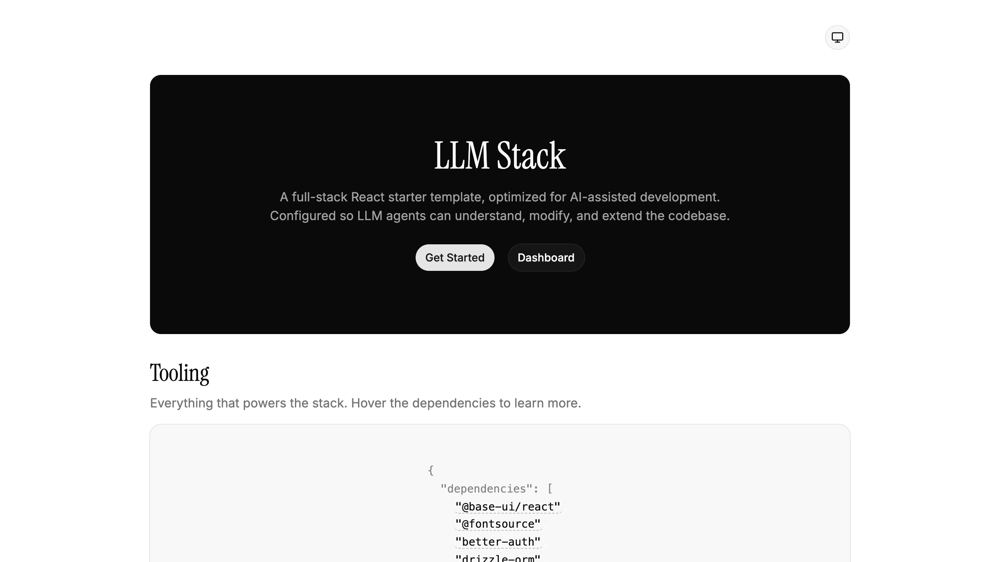

# LLM Stack

A full-stack React starter template, optimized for AI-assisted development. Configured so LLM agents can understand, modify, and extend the codebase.

<picture>
  <source media="(prefers-color-scheme: dark)" srcset="public/screenshot-dark.png">
  <source media="(prefers-color-scheme: light)" srcset="public/screenshot-light.png">
  
</picture>

## Tech Stack

| Category    | Technology                                                                                                                                        |
| ----------- | ------------------------------------------------------------------------------------------------------------------------------------------------- |
| Framework   | [React Router 7](https://reactrouter.com/) (framework mode, SSR)                                                                                 |
| UI          | [React 19](https://react.dev/), [Tailwind CSS v4](https://tailwindcss.com/), [Base UI](https://base-ui.com/) via [shadcn](https://ui.shadcn.com/) |
| Auth        | [Better Auth](https://www.better-auth.com/) (email/password, sessions, middleware)                                                                |
| Database    | [Drizzle ORM](https://orm.drizzle.team/) + SQLite ([better-sqlite3](https://github.com/WiseLibs/better-sqlite3))                                 |
| Validation  | [Zod](https://zod.dev/)                                                                                                                          |
| Formatter   | [oxfmt](https://oxc.rs/docs/guide/usage/formatter.html) (with Tailwind class sorting, import sorting, package.json sorting)                      |
| Linter      | [oxlint](https://oxc.rs/docs/guide/usage/linter.html) (with jsx-a11y, React, unicorn, and import plugins)                                        |
| Testing     | [Vitest](https://vitest.dev/)                                                                                                                     |
| Unused code | [Knip](https://knip.dev/)                                                                                                                        |
| Commits     | [Conventional Commits](https://www.conventionalcommits.org/) via [commitlint](https://commitlint.js.org/)                                        |
| Bundler     | [Vite 7](https://vite.dev/)                                                                                                                      |
| Language    | [TypeScript](https://www.typescriptlang.org/) (strict mode)                                                                                      |

## Features

- **Server-side rendering** with React Router 7 framework mode
- **Authentication** with email/password sign up, sign in, and session management
- **Protected routes** via middleware (`requireAuth` / `requireGuest`)
- **Dark mode without FOUC** — inline script sets color-scheme before first paint using a cookie
- **Type-safe database** with Drizzle ORM, auto-generated route types, and Zod validation
- **One-command setup** — install, generate env, push schema, seed DB, start dev server
- **Auto-formatting on commit** via git hooks (oxfmt on staged files)
- **Exact version pinning** — no caret or tilde ranges via `.npmrc`
- **11 custom AI agent skills** for React Router, Better Auth, security, design patterns, and more
- **4 MCP servers** for component installation, auth docs, library docs, and browser automation

> [!TIP]
> **Deploying to Vercel?** Use the [`deploy/vercel`](https://github.com/nikolailehbrink/llm-stack/tree/deploy/vercel) branch — it swaps `better-sqlite3` for [Turso](https://turso.tech/) (libSQL), adds the `@vercel/react-router` preset, and is ready for serverless deployment. See the [live demo](https://llm-stack.nikolailehbr.ink).

## Getting Started

### Prerequisites

- [Bun](https://bun.sh/), [Node.js](https://nodejs.org/), [pnpm](https://pnpm.io/), or [Deno](https://deno.com/)

### Setup

```sh
git clone https://github.com/nikolailehbrink/llm-stack.git
cd llm-stack
bun run setup  # or: npm run setup / pnpm setup / deno task setup
```

This will install dependencies, create a `.env` file with a generated secret, push the database schema, and seed a demo user (`demo@example.com` / `password123`).

### Development

```sh
bun run dev  # or: npm run dev / pnpm dev / deno task dev
```

Opens at [http://localhost:5173](http://localhost:5173).

### Using a Different Package Manager

The project defaults to Bun, but the app code is runtime-agnostic. When using a different package manager, update the `setup` script in `package.json`:

```jsonc
// npm:
"setup": "npm install && npx tsx scripts/setup.ts && npm run dev"

// pnpm:
"setup": "pnpm install && pnpm tsx scripts/setup.ts && pnpm dev"

// Deno:
"setup": "deno install && deno run -A scripts/setup.ts && deno task dev"
```

You may also want to remove or update the `packageManager` field in `package.json`.

## Scripts

All scripts are defined in `package.json` and work with any package manager.

| Script        | Description                      |
| ------------- | -------------------------------- |
| `setup`       | First-time project setup         |
| `dev`         | Start dev server with HMR        |
| `build`       | Production build                 |
| `start`       | Production server                |
| `preview`     | Preview build with Vite          |
| `typecheck`   | Generate route types and run tsc |
| `lint`        | Run oxlint                       |
| `lint:fix`    | Run oxlint with auto-fix         |
| `fmt`         | Format with oxfmt                |
| `fmt:check`   | Check formatting                 |
| `test`        | Run tests with Vitest            |
| `knip`        | Check for unused code            |
| `db:push`     | Push schema to database          |
| `db:generate` | Generate migration files         |
| `db:migrate`  | Run migrations                   |
| `db:seed`     | Seed database with demo user     |
| `db:studio`   | Open Drizzle Studio              |
| `clean`       | Remove node_modules, .react-router, and build |

## Project Structure

```
llm-stack/
├── .agents/skills/          # 11 custom AI agent skills
├── .githooks/               # Git hooks (pre-commit, pre-push, commit-msg)
├── .vscode/                 # VS Code workspace settings and extensions
├── app/
│   ├── components/
│   │   ├── ui/              # Base UI components (avatar, button, card, dropdown-menu, input, label, tooltip)
│   │   └── color-scheme-toggle.tsx
│   ├── db/
│   │   ├── index.server.ts  # Database connection (WAL mode)
│   │   ├── schema.ts        # Drizzle schema
│   │   └── seed.ts          # Database seeding script
│   ├── lib/
│   │   ├── auth.server.ts   # Better Auth instance
│   │   ├── auth-client.ts   # Client-side auth (signIn, signUp, signOut, useSession)
│   │   ├── auth-middleware.server.ts  # requireAuth & requireGuest
│   │   ├── color-scheme.server.ts     # Color scheme cookie handling
│   │   └── utils.ts         # cn() utility
│   ├── routes/
│   │   ├── home.tsx         # Landing page
│   │   ├── auth.tsx         # Sign in / sign up
│   │   ├── protected/
│   │   │   ├── layout.tsx   # Auth middleware wrapper
│   │   │   └── dashboard.tsx
│   │   └── api/
│   │       ├── auth/catch-all.ts    # Better Auth handler
│   │       └── color-scheme.ts      # Color scheme endpoint
│   ├── routes.ts            # Route definitions
│   ├── root.tsx             # Root layout
│   ├── context.ts           # Session context
│   └── app.css              # Tailwind v4 theme and styles
├── CLAUDE.md                # References AGENTS.md for Claude Code
├── AGENTS.md                # Project context, rules, and conventions for AI agents
└── .mcp.json                # MCP server configuration
```

Files suffixed `.server.ts` are excluded from client bundles.

## LLM Configuration

This project is designed to work with [Claude Code](https://docs.anthropic.com/en/docs/claude-code). The AI agent configuration consists of three layers:

### CLAUDE.md & AGENTS.md

`CLAUDE.md` references `AGENTS.md`, which serves as the single source of truth for AI agents. It covers commands, architecture, auth flow, database, UI components, tooling, and all code rules with skill references in every relevant section.

### Custom Skills (11)

Located in `.agents/skills/`, these provide specialized knowledge:

| Skill                                      | Purpose                                  |
| ------------------------------------------ | ---------------------------------------- |
| `react-router-framework-mode`              | Routes, loaders, actions, middleware, SSR |
| `better-auth-best-practices`               | Auth flow patterns and integration       |
| `better-auth-security-best-practices`      | Rate limiting, CSRF, session security    |
| `email-and-password-best-practices`        | Secure email/password auth               |
| `two-factor-authentication-best-practices` | 2FA implementation                       |
| `create-auth-skill`                        | Auth layer scaffolding                   |
| `organization-best-practices`              | Multi-tenant orgs and RBAC               |
| `frontend-design`                          | Production-grade UI design               |
| `web-design-guidelines`                    | Accessibility and UX auditing            |
| `vercel-react-best-practices`              | React performance optimization           |
| `vercel-composition-patterns`              | Component composition and architecture   |

### MCP Servers (4)

Configured in `.mcp.json`:

| Server              | Type | Purpose                                            |
| ------------------- | ---- | -------------------------------------------------- |
| **shadcn**          | CLI  | Install and manage Base UI components              |
| **better-auth**     | HTTP | Query Better Auth documentation                    |
| **context7**        | HTTP | Fetch up-to-date docs for any library              |
| **chrome-devtools** | CLI  | Browser automation, performance tracing, debugging |

## Git Hooks

Hooks are stored in `.githooks/` and activated automatically via the `prepare` script.

| Hook           | What it does                                               |
| -------------- | ---------------------------------------------------------- |
| **pre-commit** | Auto-formats staged files with oxfmt, runs oxlint and knip |
| **pre-push**   | Runs typecheck and tests                                   |
| **commit-msg** | Enforces conventional commit format                        |

## Auth Flow

1. User visits `/auth` to sign up or sign in with email/password
2. Better Auth handles credentials and creates a session cookie
3. Protected routes (e.g. `/dashboard`) use `requireAuth` middleware
4. Session data is passed via React Router context to loaders and components
5. `requireGuest` middleware redirects authenticated users away from `/auth`

Auth mutations use `clientAction` exports (browser-side) because Better Auth's client manages session cookies directly.

## License

[MIT](LICENSE)
